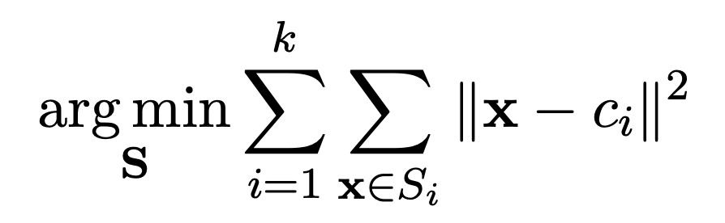
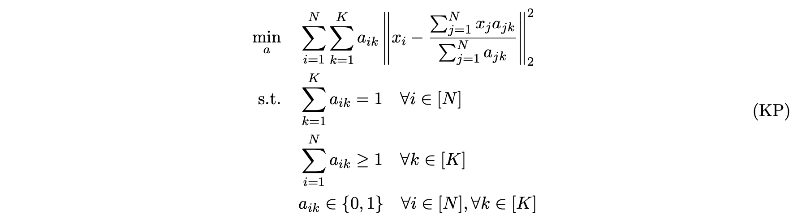
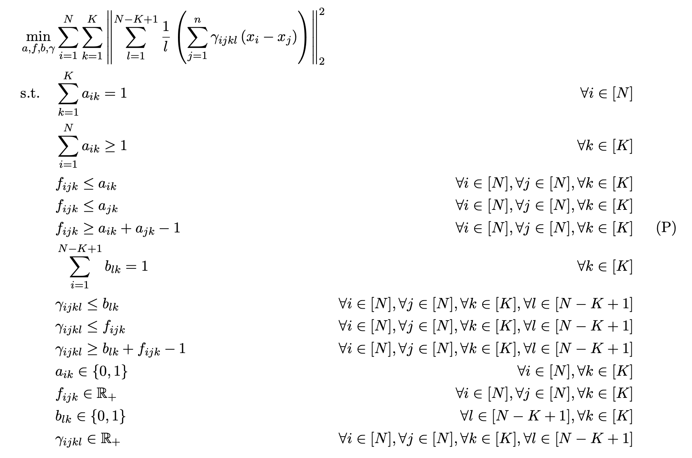
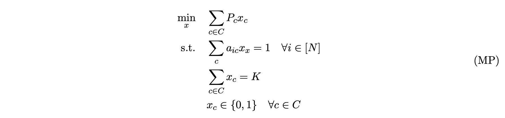
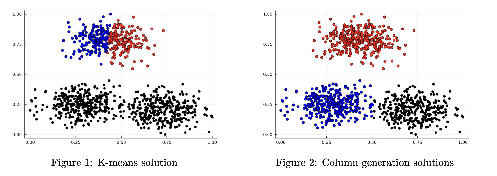
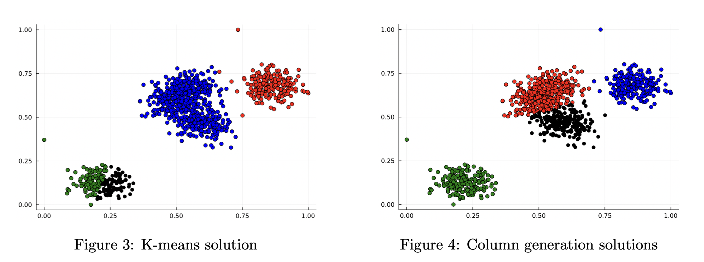

# **A column generation approach to clustering**

This is the repository for the Integer Optimization class at MIT. It has been developed by [Marco Antonioli](https://github.com/MarcoAntonioli) and [Mattia Ravasio](https://github.com/MattiaRavasio).

## **Introduction** 

Given a set of observations $(x_1, x_2, ... , x_n)$, where each observation is a d-dimensional real vector, k-means clustering aims to partition the n observations into k ($\leq n$) sets $S = {S_1, S_2, ..., S_k}$ so as to minimize the within-cluster sum of squares. The objective is to find:

<!-- $$
{\underset {\mathbf {S} }{\arg \min }}\sum _{i=1}^{k}\sum _{\mathbf{x} \in S_{i}}\left\|\mathbf {x} - c_{i}\right\|^{2}
$$ -->

Where $c_i$ is the mean of points in $S_i$: $c_{i}={\frac{1}{|S_{i}|}}\sum_{\mathbf{x} \in S_{i}}\mathbf{x}$.

One of the most widely used methods to solve this problem is the K-means algorithm. This algorithm starts with a random assignment of k centroids, then it enters in a loop where each point is assigned to one centroid in the current set of centroids, and each centroid is then recalculated as the mean of the point in the cluster, until convergence. 

Given the random initialization component, the algorithm lacks provable optimality and presents stability issues. For this reason, we aim at re-formulating the problem as a Mixed Integer Optimization problem (MIO), and try to propose a method to solve it. 

## **Mixed Integer Optimization (MIO) reformulation**

Using a data matrix $X$ of dimensions $N \times D$, with  $X_{i} \in \mathbb{R}^{D}$ representing a point, and a variable matrix $A$, with each entry $a_{ik} \in \{0,1\}$ indicating whether point $X_{i}$ belongs to cluster $k$, we can formulate the problem. 

<!-- $$
\begin{equation}
\begin{aligned}
    \min_{a} &	\quad  \sum_{i=1}^{N} \sum_{k=1}^{K} a_{ik} \left\rVert x_{i} - \frac{\sum_{j=1}^{N} x_{j}a_{jk}}{\sum_{j=1}^{N} a_{jk}} \right\rVert _{2}^{2} \\
    \text{s.t.}	& \quad	\sum_{k=1}^{K} a_{ik} = 1 \quad \forall i \in [N] \\
                & \quad	\sum_{i=1}^{N} a_{ik} \geq 1 \quad \forall k \in [K] \\
                & \quad a_{ik} \in \{0,1\} \quad \forall i \in [N], \forall k \in [K]
\end{aligned}
\tag{CP}
\end{equation}
$$ -->

This formulation of the Clustering Problem presents non-linearities, and a fractional objective. The linearization of the problem becomes: 

<!-- 
$$
\begin{equation}
    \begin{aligned}
        \min_{a,f, b, \gamma}		&	\sum_{i=1}^{N} \sum_{k=1}^{K} \left\rVert \sum_{l=1}^{N-K+1}\frac{1}{l}\left(\sum_{j=1}^{n} \gamma_{ijkl} \left( x_{i} - x_{j}\right)\right)\right\rVert _{2}^{2} \\
        \text{s.t.}	\quad 
        & \sum_{k=1}^{K} a_{ik} = 1 & \forall i \in [N] \\
        & \sum_{i=1}^{N} a_{ik} \geq 1 & \forall k \in [K] \\
        & f_{ijk} \leq a_{ik} & \forall i \in [N], \forall j \in [N], \forall k \in [K] \\
        & f_{ijk} \leq a_{jk} & \forall i \in [N], \forall j \in [N], \forall k \in [K] \\
        & f_{ijk} \geq a_{ik} + a_{jk} - 1 & \forall i \in [N], \forall j \in [N], \forall k \in [K] \\
        & \sum_{i=1}^{N-K+1} b_{lk} = 1 & \forall k \in [K] \\
        & \gamma_{ijkl} \leq b_{lk} & \forall i \in [N], \forall j \in [N], \forall k \in [K],\forall l \in [N-K+1]\\
        & \gamma_{ijkl} \leq f_{ijk} & \forall i \in [N], \forall j \in [N], \forall k \in [K],\forall l \in [N-K+1]\\
        & \gamma_{ijkl} \geq b_{lk} + f_{ijk} -1 & \forall i \in [N], \forall j \in [N], \forall k \in [K],\forall l \in [N-K+1]\\
        & a_{ik} \in \{0,1\} & \forall i \in [N], \forall k \in [K]\\
        & f_{ijk} \in \mathbb{R}_{+} & \forall i \in [N], \forall j \in [N], \forall k \in [K] \\
        & b_{lk} \in \{0,1\} & \forall l \in [N-K+1], \forall k \in [K] \\ 
        & \gamma_{ijkl} \in \mathbb{R}_{+} & \forall i \in [N], \forall j \in [N], \forall k \in [K],\forall l \in [N-K+1] \\
    \end{aligned}
    \tag{P}
\end{equation}
$$ -->

Note that this problem still presents a quadratic objective, but it can easily be handled by the Gurobi optimizer using second order cones. 

This formulation takes care of non-linearities within the problem by adding many variables. More specifically, we added $(N \cdot N \cdot K)^2 \cdot (N-K+2)$ continuous variables and $(N-K+1)\cdot K$ integer variables from the previous formulation. While this approach was effective in dealing with the non-linearities, it is easily predictable that this formulation would have scalability issues.

## **Column Generation Approach**

To tackle the scalability issue we developed a set partitioning reformulation of the problem, in which each partition will be a cluster. We will minimize the total cost $P_{c}$ of a clustering solution $c$ over all of the possible clustering combinations (the set $C$). The problem can be formulated as: 

<!-- $$
\begin{equation}
    \begin{aligned}
        \min_{x} &	\quad  \sum_{c \in C} P_{c}x_{c} \\
        \text{s.t.}	& \quad	\sum_{c} a_{ic}x_{x} = 1 \quad \forall i \in [N]\\
                    & \quad	\sum_{c \in C} x_{c} = K \\
                    & \quad x_{c} \in \{0,1\} \quad \forall c \in C
    \end{aligned}
    \tag{MP}
\end{equation}
$$ -->

This reformulation, which is seemingly very easy, hides it's complexity in the set $C$. This set is in fact the set of all possible clusters that can be created from a set of $N$ points and it has cardinality of $2^{N}$.

This formulation presents an exponential number of variable, thus to solve it we propose a column generation algorithm. We will firstly solve the linear relaxation of the Master Problem (MP) over a restricted set of possible clusters, $C_{0} \subseteq C$ (restricted MP). Then we will look for the cluster $c^{*}$ with the lowest reduced cost $\overline{P_{c^{*}}}$ in the MP. If this reduced cost is positive, we attained feasibility in the dual of the MP relaxation, and it means that it is optimal in the primal MP relaxation. If the reduced cost is negative, we will add that cluster to the set $C_{0}$, and solve again the restricted MP over the new set. 

In this context, the subproblem is: 

<!-- $$
\begin{equation}
        \overline{P_{c^{*}}} = \min_{c \in C} \{ P_{c} - \sum_{i=1}^{N} a_{ic} p^{*}_{i} - K b^{*}\}
    \tag{SP}
\end{equation}
$$ -->

### **Subproblem solution**

The suproblem formulation is itself as complicates as the full linearization of the MIO problem P, for this reason, we developed a Heuristic method to be able to have "good" clustering solutions very efficiently, and add clusters iteratively to the set of clusters $C_{0}$.

At every step we use the k-means algorithm with different initializations to generate a large number of valid columns (each initialization will generate $K$ clusters which are considered as valid column for the master problem). Among those columns we choose the one with the minimum reduced cost as the solution of the sub-problem, and either feed it back to the master problem or terminate the algorithm if the reduced cost is non-negative.
In this process, all the clusters are generated using the same K as the original K-means problem, but by using different random seeds we are able to generate multiple different clusters at each iteration. 

This heuristics is fast and generates valid columns, but sacrifices the optimality guarantee when we solve the sub-problem. Also, by generating clusters using k-means, we easily avoid generating strictly dominated columns like very bad clustering decisions. The effectiveness of this heuristic lies in the fact that we have to generate a large number of valid columns (we chose this number to be $50*K$), which are also considered to be "good" columns, and not dominated ones.

## **Results**

Over the course of the experiments we saw that our heuristic algorithm tend to outperform K-means in various instances. A central factor is the standard deviation of the clusters: by increasing the standard deviation we can generate more difficult clustering problems and we can see that in those scenarios the proposed column generation heuristics is outperforming the most the traditional approach.

The computational time taken by our algorithm depends on the difficulty of the instance, and only in very complex instances our proposed method takes up to 5 times the time taken by K-means. Given the very low computational time of K-means, our algorithm is able to converge to a solution in under 2 seconds even for instances of 1000 data points, 5 clusters and high standard deviation. Here it follows an example of an instance with 1000 points, 3 clusters and a standard deviation of 1.5, where our formulation outperforms K-means:

As it can be seen, the K-means proposed solution is clearly not the best one, while our algorithm manages to correctly separate the data into what also visually is the right clustering assignment. Here it follows another example where our formulation outperforms K-means. We have 1000 points, 4 clusters and a standard deviation of 1.5. In this second example instead we can see a different clustering choice where our algorithm chooses to generate two clusters in the middle blob, while K-means prefers to do it in the lower-left blob.

We now focus our attention on the performance of our column generation algorithm against K-means on different problem instances. We experimented for standard deviations equal to 1.5, 3, and 4.5, for number of points equal to 100, 300, 500, 700 and 1000 and for number of clusters equal to 2,3,4 and 5. For every combination of parameters we run 20 different problems, we averaged the results of those 20 to better understand the behaviour of the heuristic under the different scenarios. Over all of our tests we saw an average decrease of 2% in the cost. Here we will present the tables with the results. Every set of tables corresponds to a different standard deviation value, and in the tables the columns are the number of points and the rows are the number of clusters. The values in the table are the sum of the squared distances between the points and their assigned centroid, averaged across the 20 runs that we did with the similar setting.

